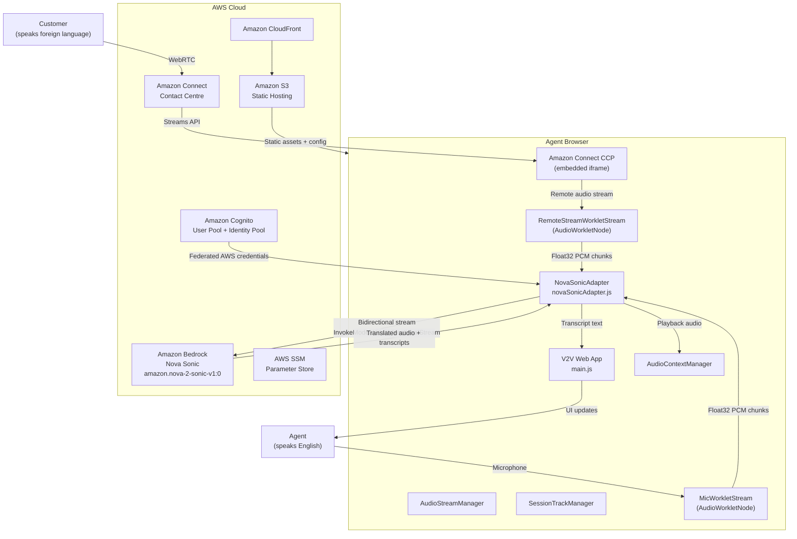
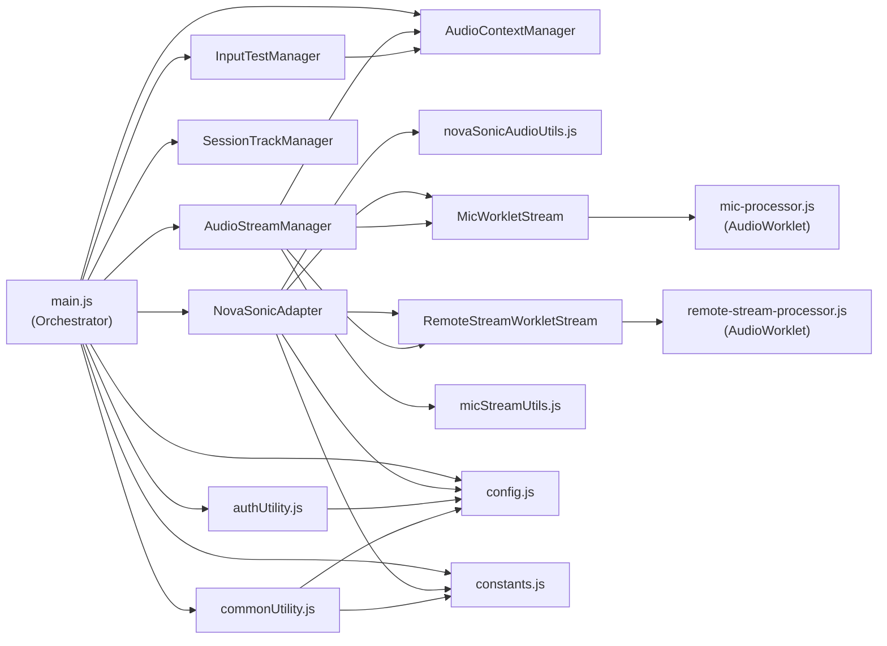
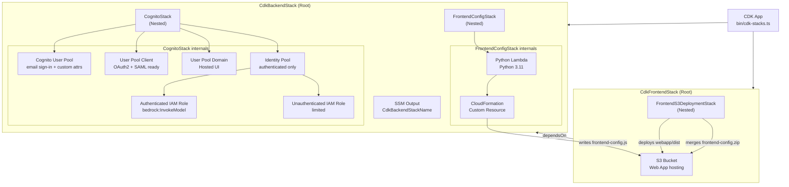

# System Architecture

# System Architecture

## High-Level Architecture

```mermaid
graph TD
    subgraph Browser["Agent Browser"]
        CCP["Amazon Connect CCP\n(embedded iframe)"]
        APP["V2V Web App\nmain.js"]
        NSA["NovaSonicAdapter\nnovaSonicAdapter.js"]
        ACM["AudioContextManager"]
        ASM["AudioStreamManager"]
        STM["SessionTrackManager"]
        MW["MicWorkletStream\n(AudioWorkletNode)"]
        RW["RemoteStreamWorkletStream\n(AudioWorkletNode)"]
    end

    subgraph AWS["AWS Cloud"]
        COGNITO["Amazon Cognito\nUser Pool + Identity Pool"]
        BEDROCK["Amazon Bedrock\nNova Sonic\namazon.nova-2-sonic-v1:0"]
        S3["Amazon S3\nStatic Hosting"]
        CF["Amazon CloudFront"]
        SSM["AWS SSM\nParameter Store"]
        CONNECT["Amazon Connect\nContact Centre"]
    end

    CUSTOMER["Customer\n(speaks foreign language)"] -->|WebRTC| CONNECT
    CONNECT -->|Streams API| CCP
    CCP -->|Remote audio stream| RW
    AGENT["Agent\n(speaks English)"] -->|Microphone| MW

    MW -->|Float32 PCM chunks| NSA
    RW -->|Float32 PCM chunks| NSA
    NSA -->|Bidirectional stream\nInvokeModelWithBidirectionalStream| BEDROCK
    BEDROCK -->|Translated audio + transcripts| NSA
    NSA -->|Playback audio| ACM
    NSA -->|Transcript text| APP
    APP -->|UI updates| AGENT

    COGNITO -->|Federated AWS credentials| NSA
    CF --> S3
    S3 -->|Static assets + config| Browser
```

---

## Module Dependency Map

```mermaid
graph LR
    main["main.js\n(Orchestrator)"]
    NSA["NovaSonicAdapter"]
    ACM["AudioContextManager"]
    ASM["AudioStreamManager"]
    STM["SessionTrackManager"]
    ITM["InputTestManager"]
    AUTH["authUtility.js"]
    COMMON["commonUtility.js"]
    AUDIO["novaSonicAudioUtils.js"]
    MWS["MicWorkletStream"]
    RWS["RemoteStreamWorkletStream"]
    MSU["micStreamUtils.js"]
    CFG["config.js"]
    CONST["constants.js"]
    WMP["mic-processor.js\n(AudioWorklet)"]
    WRP["remote-stream-processor.js\n(AudioWorklet)"]

    main --> NSA
    main --> ACM
    main --> ASM
    main --> STM
    main --> ITM
    main --> AUTH
    main --> COMMON
    main --> CFG
    main --> CONST

    NSA --> AUDIO
    NSA --> MWS
    NSA --> RWS
    NSA --> CFG
    NSA --> CONST

    ASM --> MWS
    ASM --> RWS
    ASM --> MSU
    ASM --> ACM

    MWS --> WMP
    RWS --> WRP

    AUTH --> CFG
    COMMON --> CFG
    COMMON --> CONST
    ITM --> ACM
```

---

## CDK Infrastructure Architecture

```mermaid
graph TD
    APP["CDK App\nbin/cdk-stacks.ts"]

    subgraph BACK["CdkBackendStack (Root)"]
        SSM_OUT["SSM Output\nCdkBackendStackName"]
        COG["CognitoStack\n(Nested)"]
        FCC["FrontendConfigStack\n(Nested)"]

        subgraph COG_DETAIL["CognitoStack internals"]
            UP["Cognito User Pool\nemail sign-in + custom attrs"]
            UPC["User Pool Client\nOAuth2 + SAML ready"]
            UPD["User Pool Domain\nHosted UI"]
            IP["Identity Pool\nauthenticated only"]
            AR["Authenticated IAM Role\nbedrock:InvokeModel"]
            UR["Unauthenticated IAM Role\nlimited"]
        end

        subgraph FCC_DETAIL["FrontendConfigStack internals"]
            FCL["Python Lambda\nPython 3.11"]
            CR["CloudFormation\nCustom Resource"]
        end
    end

    subgraph FRONT["CdkFrontendStack (Root)"]
        S3B["S3 Bucket\nWeb App hosting"]
        S3DEP["FrontendS3DeploymentStack\n(Nested)"]
    end

    APP --> BACK
    APP --> FRONT
    FRONT --> |dependsOn| BACK

    COG --> UP
    COG --> UPC
    COG --> UPD
    COG --> IP
    IP --> AR
    IP --> UR

    FCC --> FCL
    FCL --> CR
    CR -->|writes frontend-config.js| S3B

    S3DEP -->|deploys webapp/dist| S3B
    S3DEP -->|merges frontend-config.zip| S3B
```

---

## Audio Processing Pipeline

```mermaid
graph LR
    subgraph MicPipeline["Agent Mic Pipeline (off-main-thread)"]
        MIC["navigator.mediaDevices\n.getUserMedia()"]
        MS["MediaStreamSource\nNode"]
        MWN["AudioWorkletNode\nmic-processor.js\n4096-frame buffer"]
        MCH["Float32Array\nchunks"]
    end

    subgraph RemotePipeline["Customer Remote Pipeline (off-main-thread)"]
        RTC["WebRTC\nRemoteMediaStream"]
        RS["MediaStreamSource\nNode"]
        RWN["AudioWorkletNode\nremote-stream-processor.js\n4096-frame buffer"]
        RCH["Float32Array\nchunks"]
    end

    subgraph Encoding["Audio Encoding (main thread)"]
        F2P["float32ToPcm16LittleEndian()"]
        RES["resamplePcm16Linear()\nsource rate → 16 kHz"]
        B64["Base64 encode"]
    end

    subgraph NovaSonic["Nova Sonic (Bedrock)"]
        NS["InvokeModelWith\nBidirectionalStream"]
        TR["Transcript events"]
        AO["Audio output events"]
    end

    subgraph Playback["Audio Playback"]
        WAV["pcm16MonoToWavArrayBuffer()"]
        DEC["AudioContext\n.decodeAudioData()"]
        BSN["BufferSourceNode\n.start()"]
        SPK["🔊 Agent Speakers"]
    end

    MIC --> MS --> MWN --> MCH
    RTC --> RS --> RWN --> RCH

    MCH --> F2P --> RES --> B64 --> NS
    RCH --> F2P --> RES --> B64 --> NS

    NS --> TR
    NS --> AO --> WAV --> DEC --> BSN --> SPK
```
