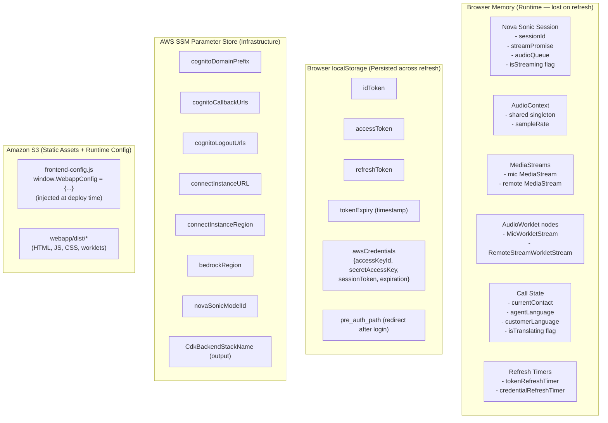
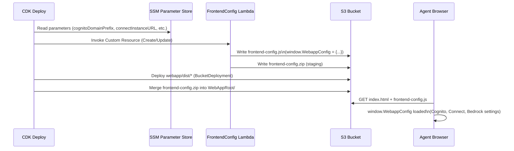
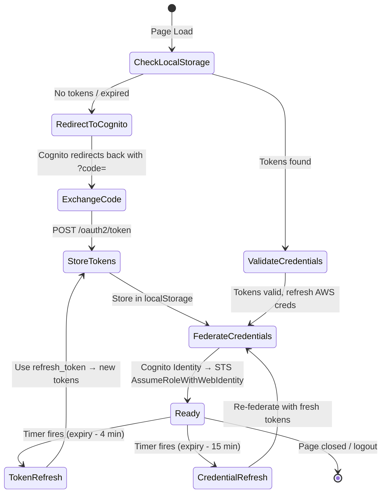

# Database & Data Structure

# Data Storage & State Management

> This project has **no traditional database**. State is managed across three tiers: browser memory (runtime), browser localStorage (session persistence), and AWS SSM Parameter Store (infrastructure config).

---

## State Storage Map



---

## Data Flow: Configuration Loading



---

## Data Flow: Token & Credential Lifecycle



---

## Key Data Structures

### `window.WebappConfig` (injected at deploy)
```json
{
  "backendRegion": "us-east-1",
  "identityPoolId": "us-east-1:xxxxxxxx-...",
  "userPoolId": "us-east-1_XXXXXXX",
  "userPoolWebClientId": "xxxxxxxxxxxxxxxxxx",
  "cognitoDomainURL": "https://prefix.auth.us-east-1.amazoncognito.com",
  "connectInstanceURL": "https://alias.my.connect.aws",
  "connectInstanceRegion": "us-east-1",
  "bedrockRegion": "us-east-1",
  "novaSonicModelId": "amazon.nova-2-sonic-v1:0"
}
```

### Nova Sonic Session Event (sent to Bedrock)
```json
{
  "sessionStart": {
    "inferenceConfiguration": { "maxTokens": 1024, "temperature": 0.7 },
    "systemPrompt": "You are a real-time interpreter...",
    "audioInputConfiguration": { "mediaType": "audio/lpcm", "sampleRateHertz": 16000 },
    "audioOutputConfiguration": { "mediaType": "audio/lpcm", "sampleRateHertz": 16000 }
  }
}
```

### AWS Credential Object (localStorage)
```json
{
  "accessKeyId": "ASIA...",
  "secretAccessKey": "...",
  "sessionToken": "...",
  "expiration": "2025-01-01T12:00:00.000Z"
}
```
