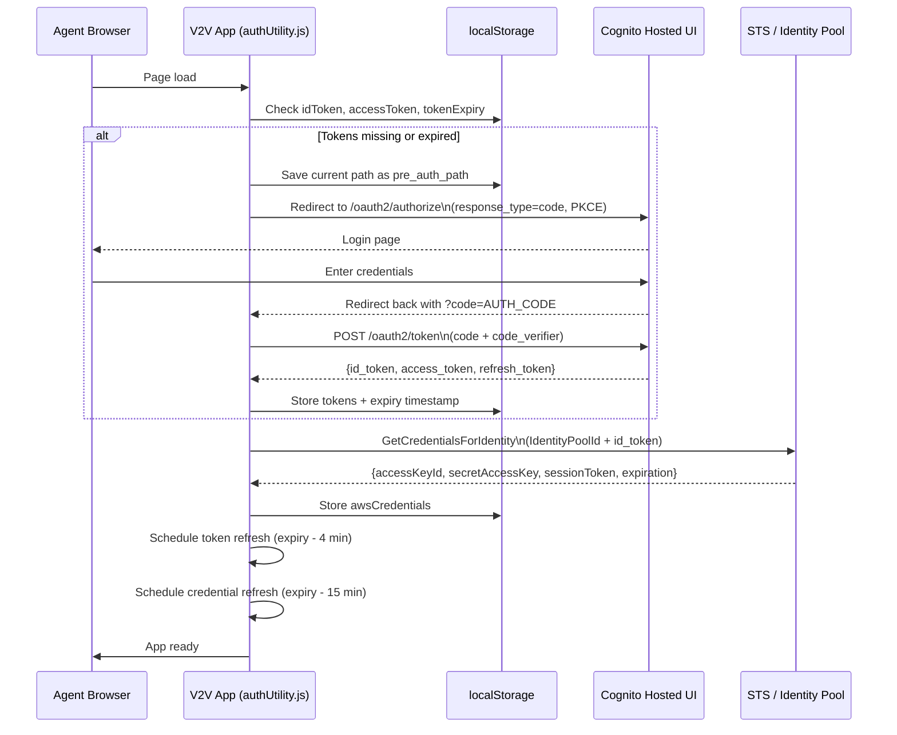
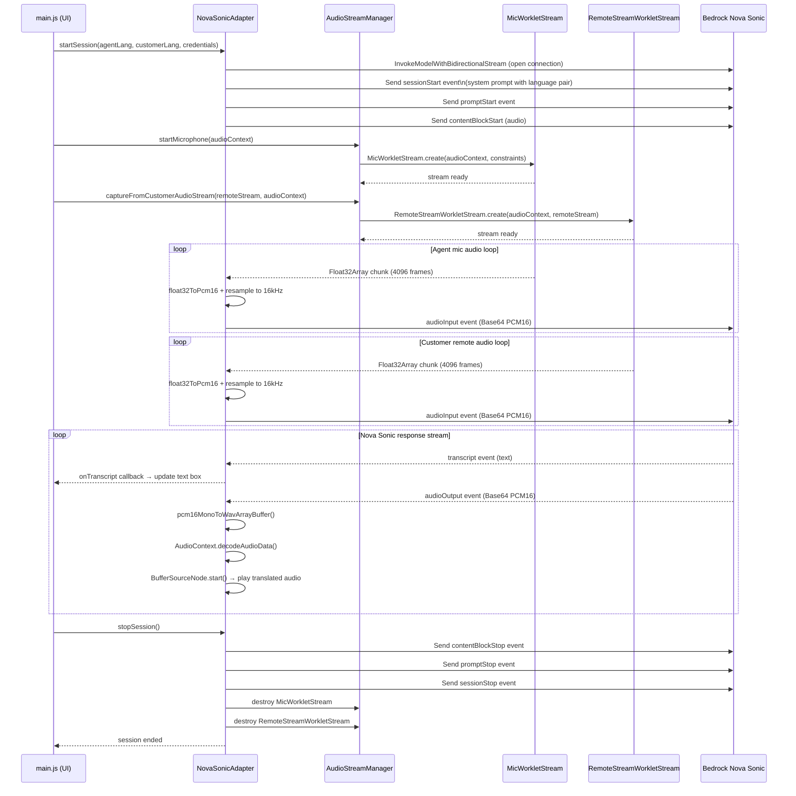
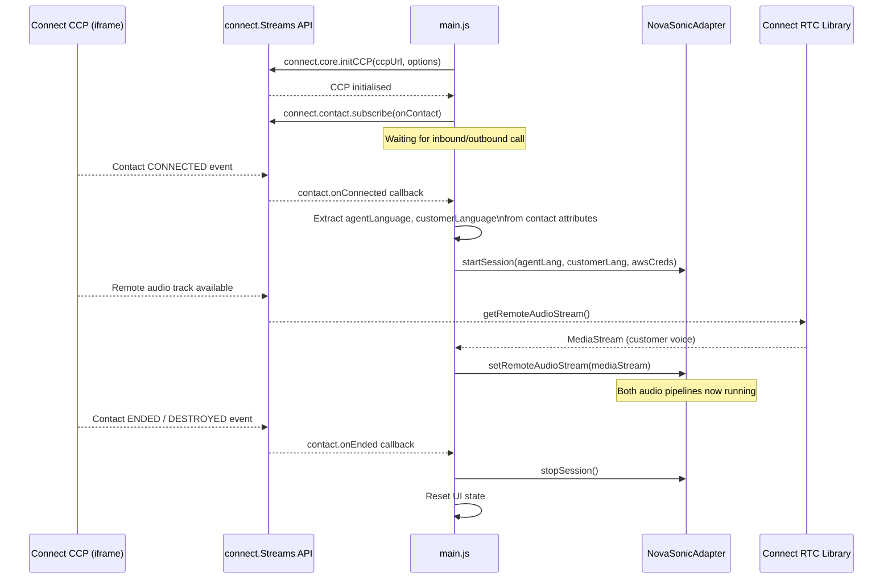
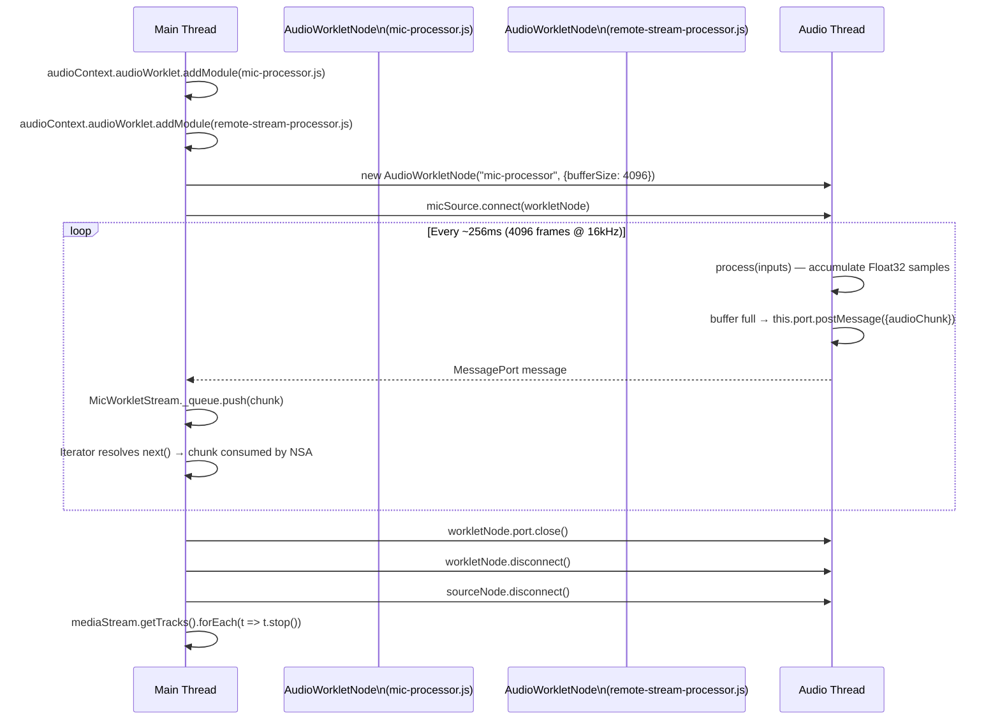
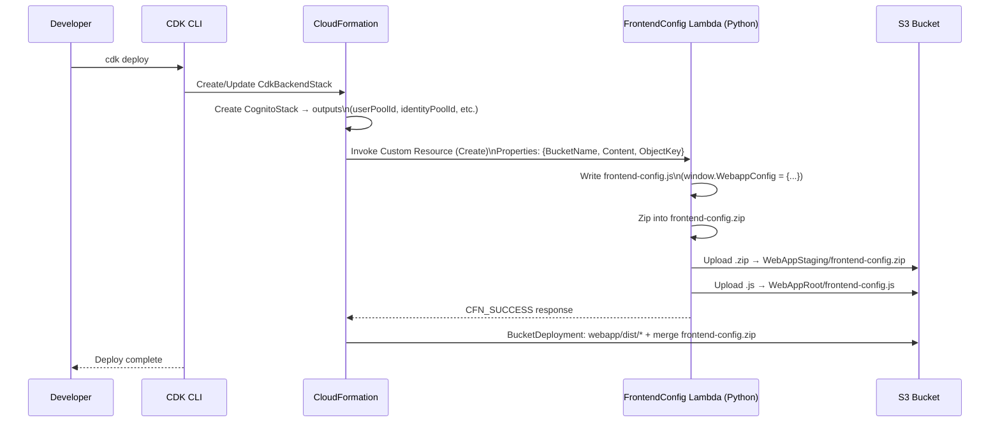

# Technical Flows

# Technical Flows

## 1. Authentication Flow (OAuth2 + Cognito Identity Federation)

---

## 2. Nova Sonic Session Lifecycle

---

## 3. Amazon Connect Call Integration Flow

---

## 4. AudioWorklet Pipeline (Off-Main-Thread Audio Capture)

---

## 5. Frontend Config Injection Flow (CDK Deploy)

