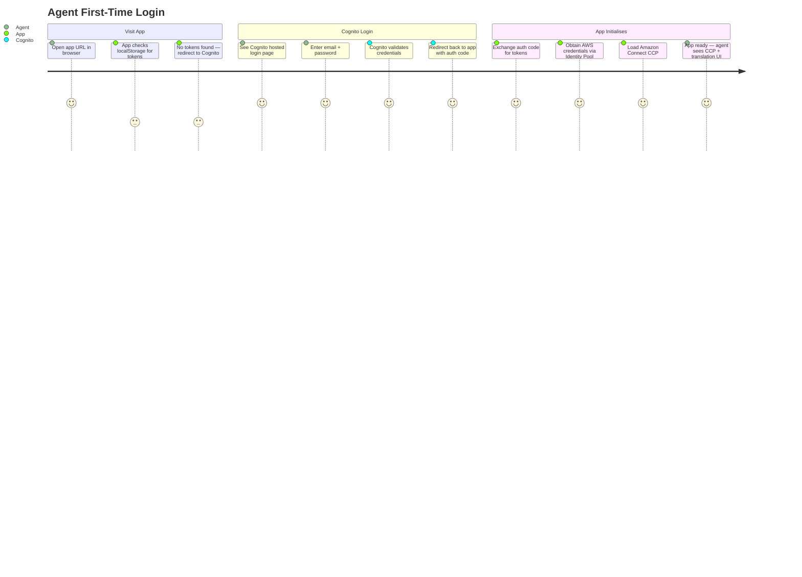
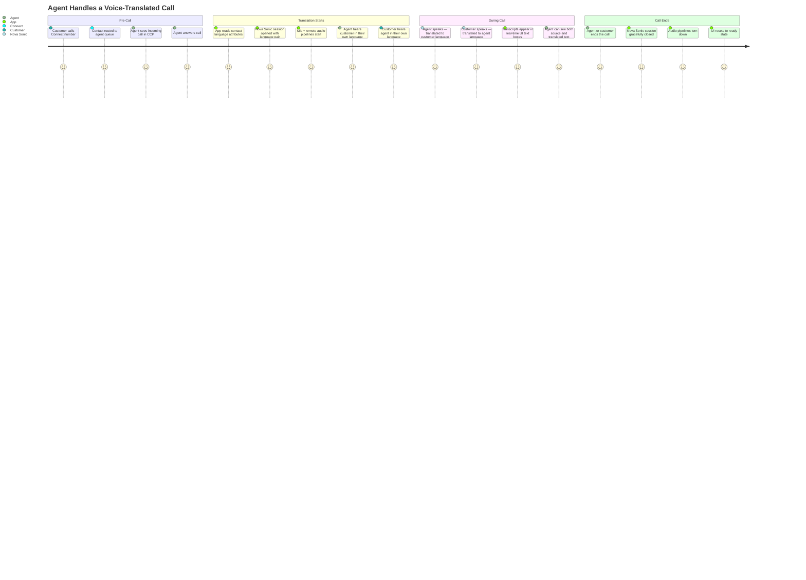
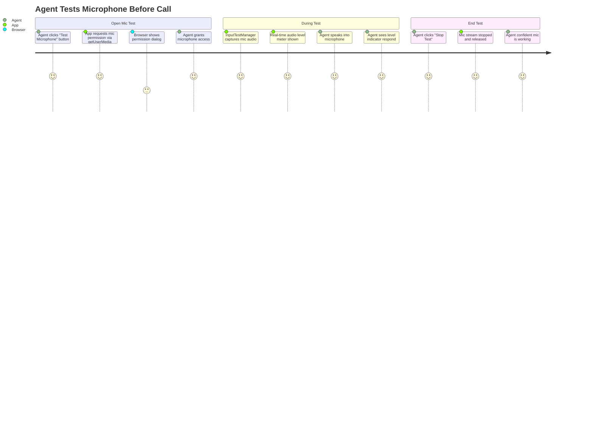
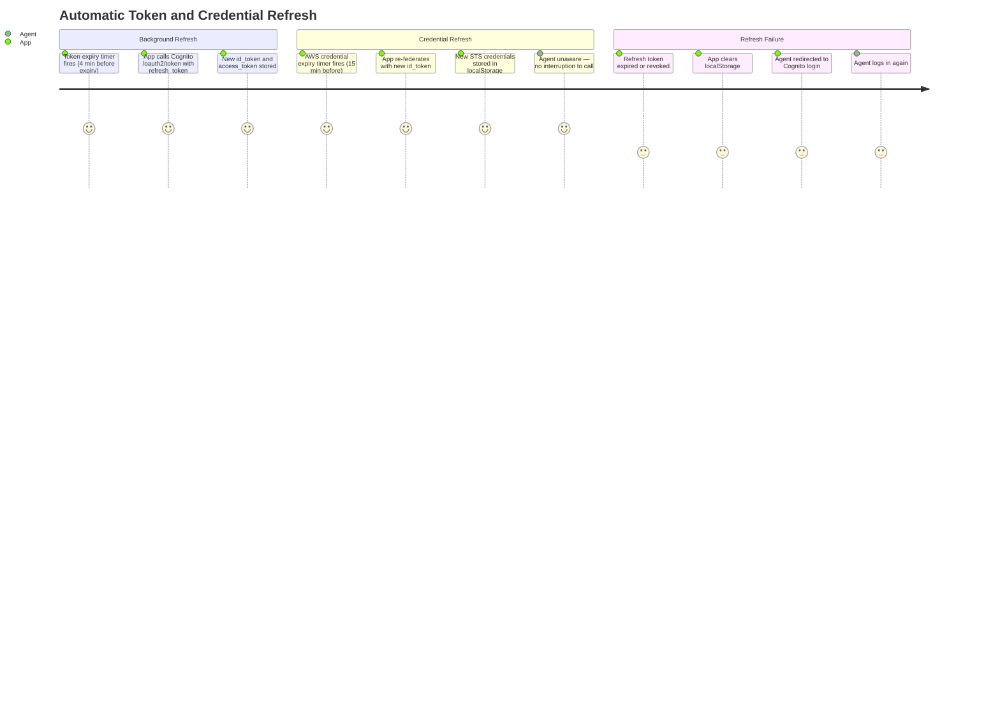
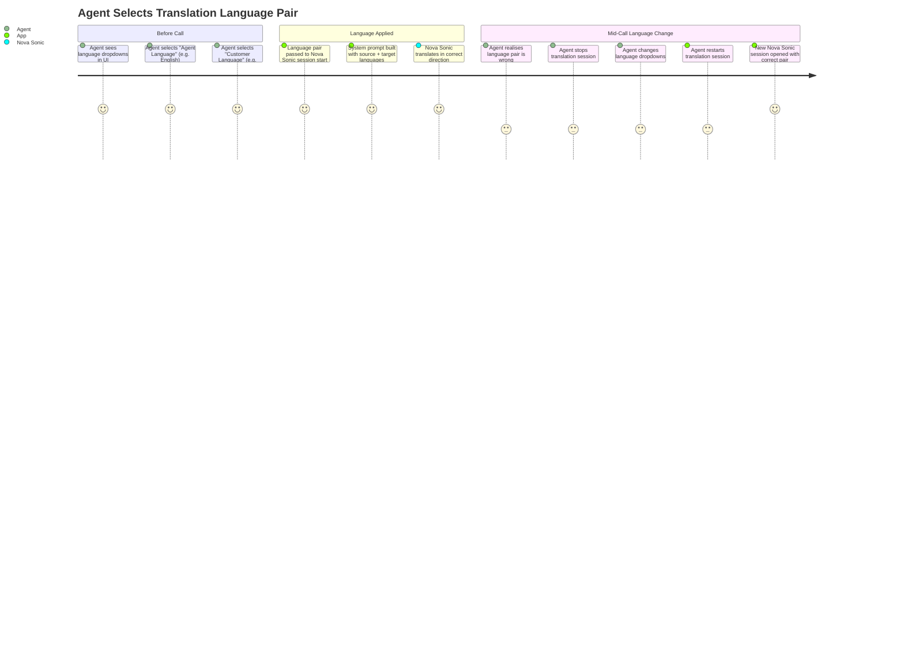

# User Journeys

# User Journeys

## 1. Agent First-Time Login Journey

---

## 2. Agent Handles a Translated Call

---

## 3. Agent Mic Test Journey

---

## 4. Token / Session Expiry & Auto-Refresh Journey

---

## 5. Language Selection Journey

