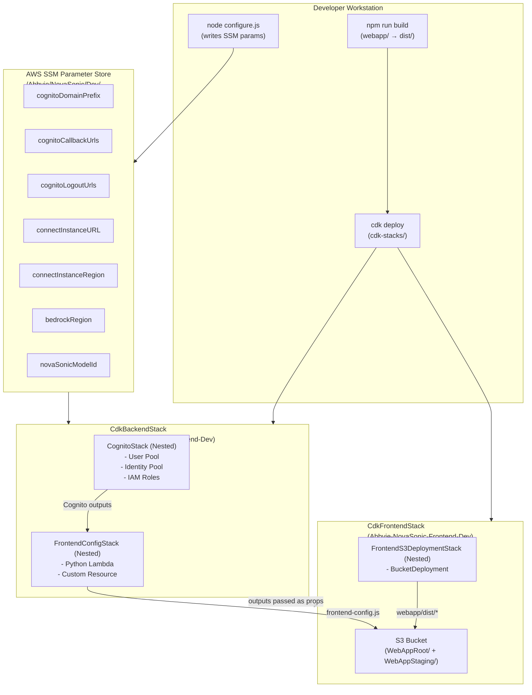
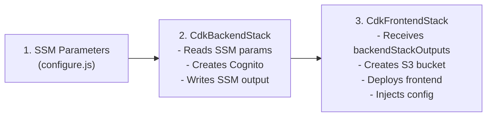
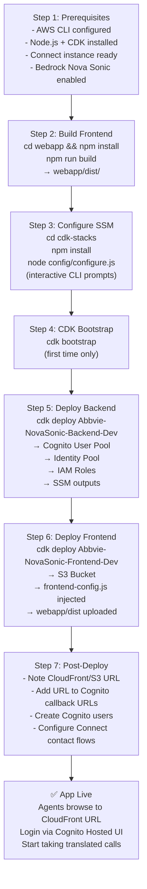
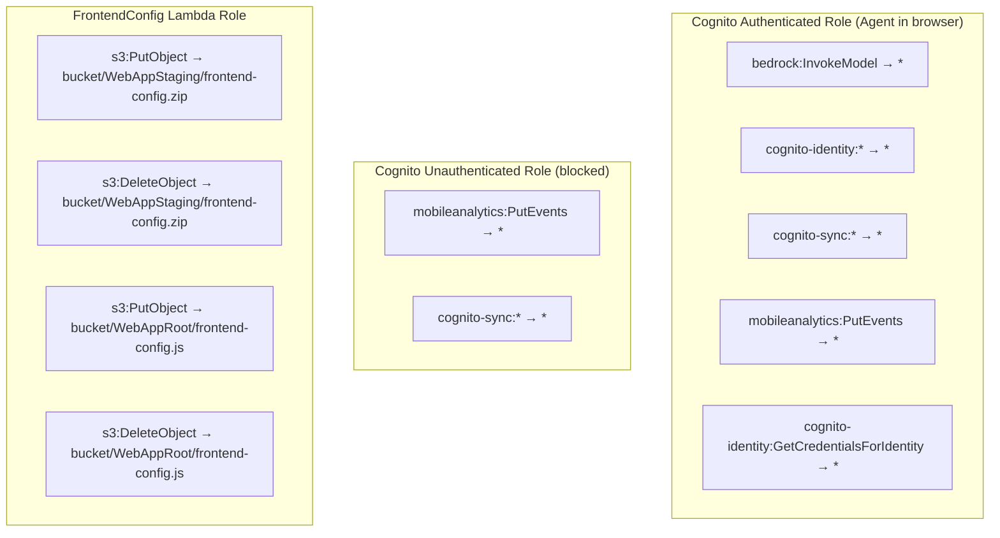

# Deployment Architecture

# Deployment Architecture

## Infrastructure Overview

---

## CDK Stack Dependency Chain

---

## Step-by-Step Deployment Process

---

## Runtime AWS Service Dependencies

| Service | Purpose | Auth Mechanism |
|---|---|---|
| **Amazon Cognito User Pool** | Agent identity & login | OAuth2 hosted UI |
| **Amazon Cognito Identity Pool** | Exchange id_token for AWS creds | `GetCredentialsForIdentity` |
| **Amazon Bedrock Nova Sonic** | Real-time voice translation | STS temporary credentials |
| **Amazon Connect** | Contact centre + WebRTC | Connect Streams API |
| **Amazon S3** | Static web app hosting | Public (CloudFront) |
| **AWS SSM Parameter Store** | CDK deploy-time config | CDK IAM role |
| **AWS CloudFormation** | Stack lifecycle management | CDK IAM role |

---

## IAM Permissions Summary

---

## Configuration Parameters Reference

| Parameter | SSM Path | Example Value | Required |
|---|---|---|---|
| `cognitoDomainPrefix` | `/Abbvie/NovaSonic/Dev/cognitoDomainPrefix` | `abbvie-v2v-connect` | ✅ |
| `cognitoCallbackUrls` | `/Abbvie/NovaSonic/Dev/cognitoCallbackUrls` | `https://xxx.cloudfront.net` | ✅ |
| `cognitoLogoutUrls` | `/Abbvie/NovaSonic/Dev/cognitoLogoutUrls` | `https://xxx.cloudfront.net` | ✅ |
| `connectInstanceURL` | `/Abbvie/NovaSonic/Dev/connectInstanceURL` | `https://alias.my.connect.aws` | ✅ |
| `connectInstanceRegion` | `/Abbvie/NovaSonic/Dev/connectInstanceRegion` | `us-east-1` | ✅ |
| `bedrockRegion` | `/Abbvie/NovaSonic/Dev/bedrockRegion` | `us-east-1` | ✅ |
| `novaSonicModelId` | `/Abbvie/NovaSonic/Dev/novaSonicModelId` | `amazon.nova-2-sonic-v1:0` | ✅ |
